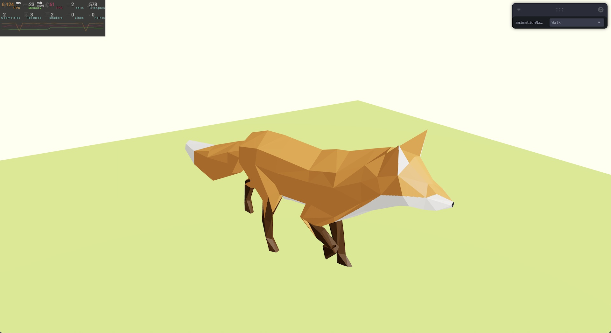

# Model Animations

This project explores loading an external model into a 3D scene and allowing users to dynamically apply its inherent animations. It was created with Three.js and React Three Fiber.

It features a model of a fox. In the upper-right corner is a GUI that allows users to choose between three animations: survey, run, and walk.

The project also displays a performance monitor for profiling different performance indicators, such as FPS, memory usage, and GPU load.

The work was undertaken as one of many steps in acquiring [my Three.js certification](https://threejs-journey.com/certificate/view/24741) through [Three.js Journey](https://threejs-journey.com/).

## Live demo

A running demo of the project can be viewed at https://dvdjrnx.github.io/model-animations

## Local development

### Installation

1. Clone the repository.
2. Install the required dependencies by running `npm install`.

### Usage

To start the project, run the following command:

`npm run dev`
